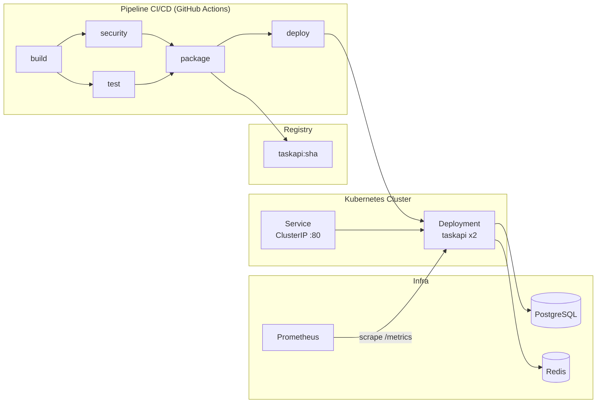

# TaskAPI — Pipeline DevSecOps CI/CD

API REST Node.js pour gérer des tâches, avec un pipeline CI/CD complet : scans de sécurité automatisés, image Docker sécurisée, déploiement Kubernetes et métriques Prometheus.

---

## Architecture



---

## Prérequis

- Docker >= 24
- docker-compose >= 2
- kubectl >= 1.28
- Node.js 20 (dev local uniquement)

---

## Lancer en local

```bash
cp .env.example .env
docker-compose up -d
curl localhost:3000/health
```

---

## Déploiement Kubernetes

```bash
kubectl apply -f k8s/
```

---

## Pipeline CI/CD

5 stages : `build` installe les dépendances. `test` et `security` tournent en parallèle. `package` build et scanne l'image puis génère le SBOM. `deploy` simule le déploiement (uniquement sur `main`).

| Stage | Ce que ça fait |
|---|---|
| **build** | npm ci + cache |
| **test** | Jest + couverture |
| **security** | Gitleaks, Semgrep, Trivy SCA |
| **package** | Build image, Trivy image, SBOM Syft |
| **deploy** | kubectl simulé sur main |

---

## Outils de sécurité

| Outil | Rôle | Stage |
|---|---|---|
| Gitleaks | Secrets dans le code | security |
| Semgrep | Analyse statique SAST | security |
| Trivy (fs) | Dépendances npm | security |
| Trivy (image) | Image Docker | package |
| Syft | SBOM CycloneDX | package |

---

## Métriques (`/metrics`)

- `http_requests_total` — counter par méthode, route, code HTTP
- `http_request_duration_seconds` — histogram par méthode et route
- Métriques Node.js par défaut (CPU, mémoire, event loop)

---

## Routes

| Méthode | Route | |
|---|---|---|
| GET | `/health` | Healthcheck |
| GET | `/metrics` | Prometheus |
| GET | `/api/tasks` | Liste des tâches |
| POST | `/api/tasks` | Créer une tâche |
| GET | `/api/tasks/:id` | Tâche par ID |
